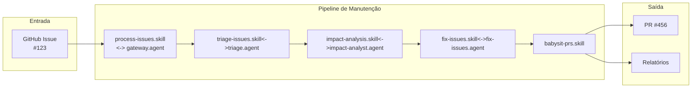

**Spec Kit de Manutenção de Software (ISO/IEC 14764)**

Kit de agentes inteligentes para automação do processo de manutenção de software, alinhado à norma **ISO/IEC/IEEE 14764:2022**, integrado com GitHub Issues e construído sobre o GitHub Spec Kit.

📂 Estrutura de Diretórios

```
spec-kit-manutencao/
├── .specify/                          # Configuração do Spec Kit e agentes
│   ├── constitution.md                # Princípios e guardrails do projeto
│   ├── agents/                        # Agentes de IA (instruções em Markdown)
│   │   ├── gateway-agent.agent.md     # Classifica a issue e inicia o fluxo
│   │   ├── triage-agent.agent.md      # Valida e rotula a issue (ISO 14764)
│   │   ├── impact-analyst.agent.md    # Analisa impacto da mudança
│   │   ├── implementer.agent.md       # Gera a correção (rascunho do PR)
│   │   └── reviewer.agent.md          # Revisa PRs e mudanças geradas
│   ├── skills/                        # Skills (procedimentos reutilizáveis)
│   │   ├── process-issues.skill.md    # Orquestra o pipeline completo
│   │   ├── triage-issues.skill.md     # Executa a triagem das issues
│   │   ├── impact-analysis.skill.md   # Analisa impacto e gera relatório
│   │   ├── fix-issues.skill.md        # Implementa a correção e abre PR
│   │   └── babysit-prs.skill.md       # Monitora e gerencia PRs abertos
│   └── rules/                         # Regras automáticas (carregadas por todos os agentes)
│       ├── iso-14764.rules.md         # Etapas obrigatórias segundo a norma
│       └── github-workflow.rules.md   # Regras de integração com GitHub
├── src/
│   └── integrations/
│       ├── github_client.py           # Código Python para buscar issues via API
│       ├── github_actions.py          # Código para criar PRs, labels, comentários
│       └── event_handler.py           # Handler para webhooks do GitHub
├── docs/
│   ├── process-model.md               # Descrição detalhada do fluxo de manutenção
│   ├── architecture.md                # Arquitetura dos agentes e skills
│   └── templates/
│       ├── impact-report.template.md  # Template para o relatório de impacto
│       ├── pr-description.template.md # Template para descrição do PR
│       └── issue-comment.template.md  # Template para comentários automáticos
├── specs/                             # Artefatos gerados (especificações)
│   └── changes/                       # Cada manutenção vira uma subpasta
│       └── ISSUE-{numero}/
│           ├── spec.md                # Especificação da correção
│           ├── impact-analysis.md     # Relatório de impacto gerado
│           └── review.md              # Resultado da revisão (aprovado/rejeitado)
├── tests/                             # Testes do spec-kit
│   ├── unit/
│   │   └── test_github_client.py
│   └── integration/
│       └── test_agent_flow.py
├── scripts/
│   ├── setup.sh                       # Script de configuração inicial
│   └── run_agent.sh                   # Script para executar os agentes
├── .env.example                       # Exemplo de variáveis de ambiente
└── README.md                          # Documentação do projeto

```
**Fluxo Principal/Pipeline**



